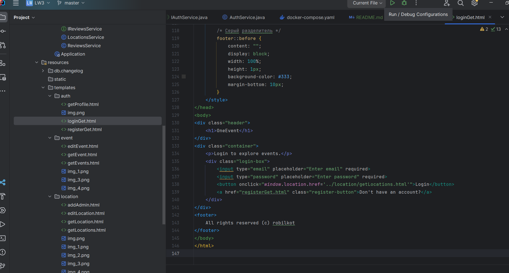
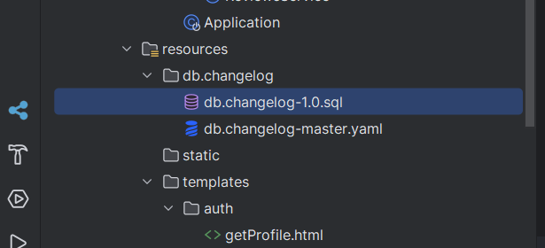

# Инструкция по запуску

## Дествия перед запуском

Что необходимо скачать для запуска:

1. IntelliJ Idea
2. Docker - для того, чтобы запустить бд, которая не будет использоваться)))
3. Java 17. Ее можно скачать прямо в IDE. Для этого надо перейти в Project Structure(ctrl + alt + shift + s)
   
4. Возможно потребуется скачать систему сборки Gradle(тоже можно сделать в IDE). Перейти в Settings -> Build, Execution,
   Deployment -> Build Tools -> Gradle. Проставить все как на скриншоте.
   

## Действия для запуска

1. Запустить докер.
2. Открыть терминал в директории LW2(корне) и выполнить команду docker-compose up
3. Перейти в IDE, выбрать файл Application.java и запустить.
   

## Примечания

1. Сами окна независимы от приложения, т.е. чтобы посмотреть макет достаточно просто открыть любую html(находятся в папке resources/templates) и запустить с
   IDE. (Т.е. для просмотра макета не надо запускать бд и само приложение).
   
2. Докер все таки придется ставить, потому что изначально думал, что нужно писать полную реализацию, из-за чего
   насоздавал классов сущностей, которые связаны с бд.
3. Таблицы накатываются из файла db.changelog-1.0.sql из папки resources
   

